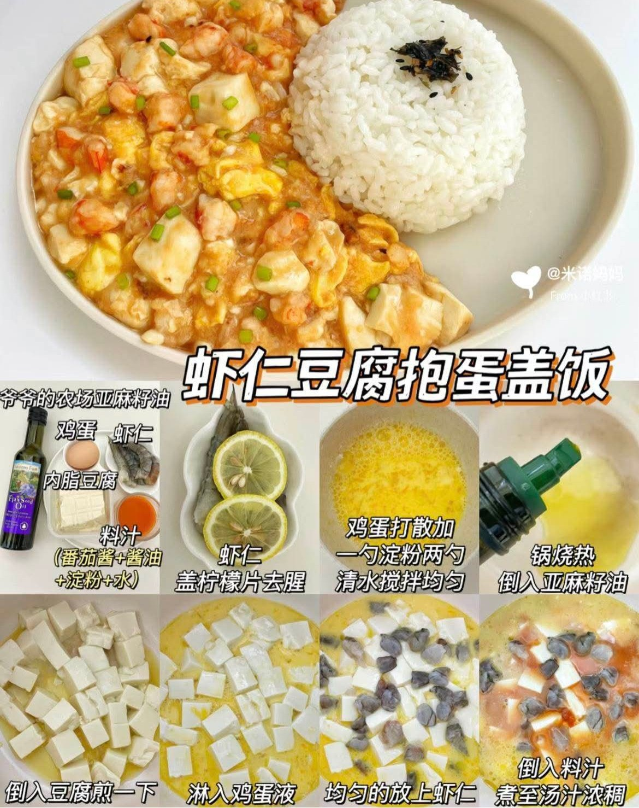
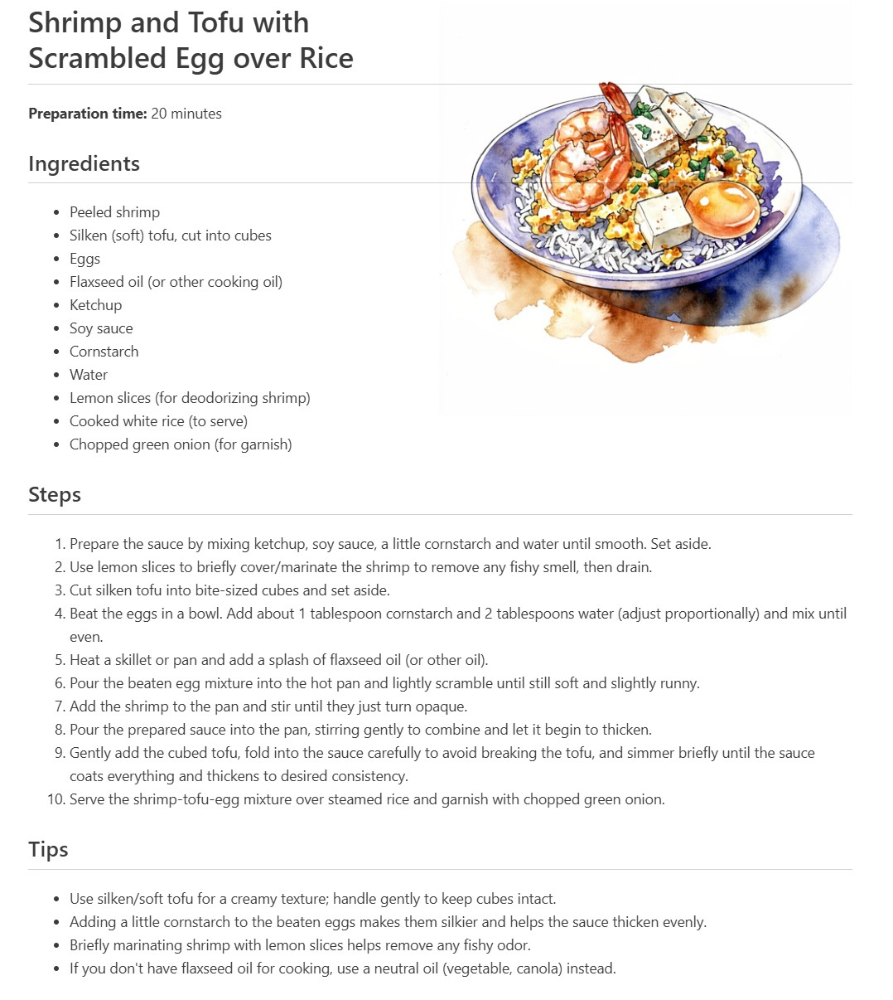
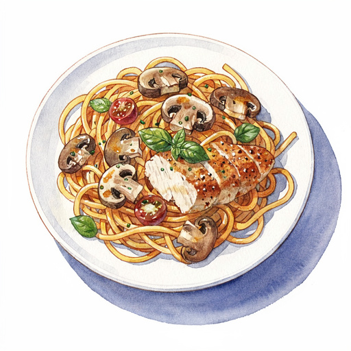
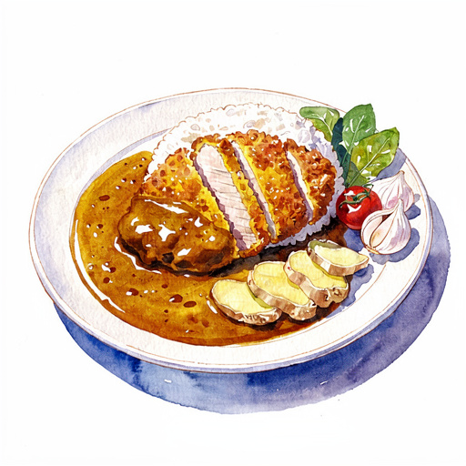
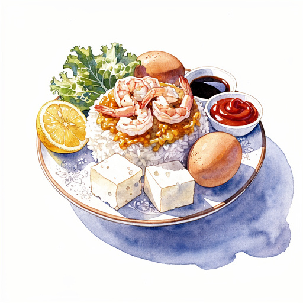
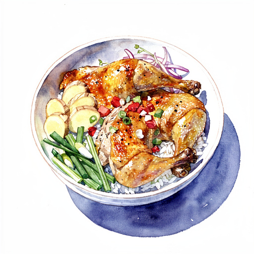

# Pretty Cookbook

Have you ever wanted to create a beautiful, personalized cookbook from your collection of recipe photos? **Pretty Cookbook** leverages the power of AI models to extract recipe information from **any language** into **any language** and generate stunning custom-style illustrations for each dish.

With this tool, you can transform your recipe photos into a professionally formatted cookbook, complete with detailed instructions and artistic visuals that match your desired style.

What it does:
- **Ingredient and recipe extraction** Identifies and structures recipe data from single photo.
- **Cooking steps enrichment** Improves clarity and detail of instructions.
- **Multilingual support** Convert from and to any language.
- **Style-consistent illustration** Generates artistic illustration of the dish matching your reference style.

## Example
| Input Recipe Photo | Generated Cookbook Page |
|-------------------|------------------------|
|  |  |


More examples of generated illustrations in watercolor style:

| Creamy Mushroom Pasta With Chicken | Curry Pork Cutlet Rice Katsu Curry | Shrimp And Silken Tofu With Egg Over Rice | Garlic Chicken Thigh Rice Bowl |
|-------------------|------------------------|------------------------|------------------------|
|  |  |  |  |


## Features

- **Local Photo Processing**: Ingests recipe photos (JPG, PNG) directly from a local directory.
- **Multimodal Extraction**: Uses GPT-4o with Pydantic structured outputs to accurately extract dish names, ingredients, and steps.
- **Multilingual Support**: Generate your cookbook in any language (English, French, Chinese, etc.).
- **High-Fidelity Illustrations**: Leverages FLUX.2-pro with **Image-to-Image** and **Style References** to create illustrations matching your recipe's visual context and a target artistic style.
- **Markdown Export**: Produces ready-to-print recipe files with embedded illustrations and relative image paths.

## Prerequisites

- Python 3.13 or higher.
- [Poetry](https://python-poetry.org/docs/#installation) installed on your system.

## Installation

1. Clone the repository:
   ```bash
   git clone <repository-url>
   cd vibe_cookbook
   ```

2. Install dependencies:
   ```bash
   poetry install
   ```

## Usage

### Required Environment Variables

The app supports separate endpoints for Chat (extraction) and Images (generation) to accommodate FLUX.2-pro on Serverless/MaaS deployments.

```bash
# Chat / Extraction (GPT-4o)
AZURE_OPENAI_ENDPOINT=https://your-resource.openai.azure.com
AZURE_OPENAI_API_KEY=your-api-key
AZURE_OPENAI_API_VERSION=2024-08-01-preview
AZURE_OPENAI_CHAT_DEPLOYMENT=gpt-4o

# Image Generation (FLUX.2-pro / DALL-E)
# Use the Target URI for Serverless deployments
AZURE_OPENAI_IMAGE_ENDPOINT=https://flux-xxxx.eastus.models.ai.azure.com
AZURE_OPENAI_IMAGE_API_KEY=your-flux-api-key
AZURE_OPENAI_IMAGE_DEPLOYMENT=FLUX.2-pro
```

### Running the Application

You can run the pipeline using the Poetry script:

```bash
poetry run app \
  --input-dir path/to/photos \
  --language "English" \
  --output-dir output \
  --reference-style-dir reference_style
```

### Reference Style

Place images that represent your desired aesthetic in the `reference_style/` folder. The AI will analyze these to ensure the generated illustrations follow a consistent style.

## Running Tests

Verify the pipeline and AI integration with Pytest:

```bash
poetry run pytest
```

## Project Structure

```text
vibe_cookbook/
├── cookbook/           # Main package source code
│   ├── ai.py           # Azure OpenAI & FLUX logic
│   ├── pipeline.py     # Orchestration logic
│   ├── main.py         # CLI entry point
│   └── ...
├── reference_style/    # Style reference images (watercolor, etc.)
├── output/
│   ├── recipes/        # Final markdown and illustrations
│   └── splits/         # Preprocessed image crops
└── tests/              # Unit tests with AAA pattern
```

## License

This project is licensed under the MIT License - see the LICENSE file for details.
